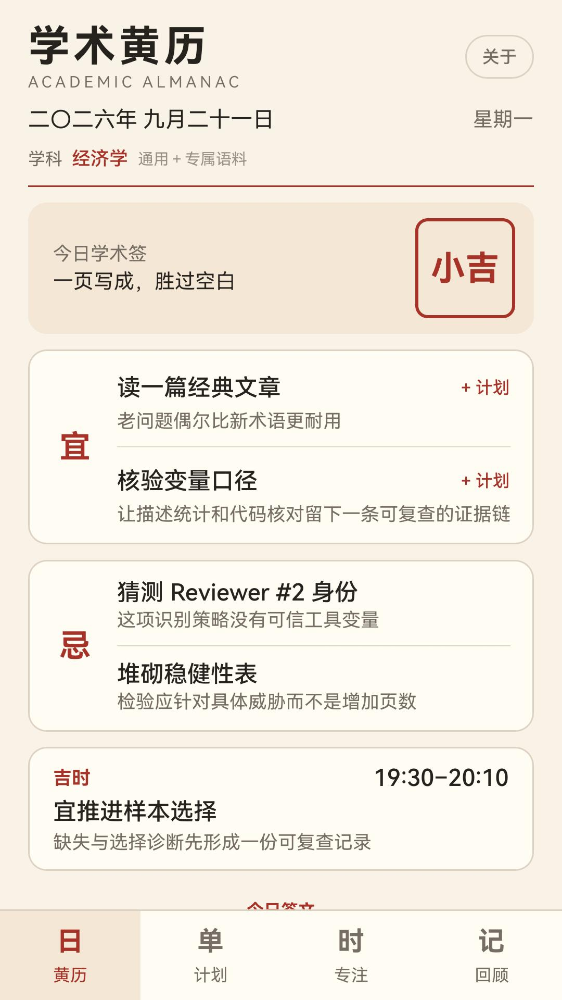

# 学术黄历 Academic Almanac

> 科研人的每日宜忌。

一款面向科研人员的离线日签与工作台。HarmonyOS 5 及以上使用 ArkTS / ArkUI 原生版；HarmonyOS 4.x 使用独立的 Android 兼容版。首次使用需从 14 个学科门类中选择一个，每天依据本机日期混合通用与该学科专属语料，生成两条“宜”、两条“忌”、吉时与学术签；同一天内容不变，第二天自动更新。

## 安装与下载

- HarmonyOS 5 及以上：[华为应用市场原生版](https://appgallery.huawei.com/app/detail?id=com.beibeihk.academicalmanac)
- HarmonyOS 4.x：[华为应用市场兼容版](https://appgallery.huawei.com/app/detail?id=com.beibeihk.academicalmanac.android)
- 独立安装包：[GitHub Releases](https://github.com/beibeihk/academic-almanac-harmonyos/releases)

两个市场版本均已正式上架。它们使用不同包名和独立的本机数据空间，不提供自动数据迁移。刚上架或应用市场索引尚未同步时，可通过上面的直达链接打开。

- 完全离线，无账号、广告、统计 SDK 或第三方 SDK
- 不申请网络、位置、相册、联系人等权限
- FNV-1a + xorshift32 确定性日更
- 14 个学科门类、560 条专属语料和 194 条通用语料；可在“关于”中修改学科
- 日期翻阅和日签收藏；科研计划新增、完成与带入专注
- 15/25/45/60 分钟专注计时，支持暂停、继续和重置
- 七日进度统计与每日回顾；记录只在本机保存，可确认清除
- 原生 `.app`：HarmonyOS 5.0.0(12)+，目标 SDK 6.0.2(22)
- Android `.apk`：供 HarmonyOS 4.x 等仍支持 Android 应用的设备使用，minSdk 26；与原生版包名和本机数据空间独立，不提供自动迁移

## 界面预览

| 选择学科 | 每日黄历 | 科研计划 |
| --- | --- | --- |
|  |  |  |

## 技术实现

- HarmonyOS 原生端：ArkTS / ArkUI，支持 HarmonyOS 5.0.0(12)+
- HarmonyOS 4 兼容端：独立 Android 应用，`minSdk 26`、`targetSdk 35`
- 内容生成：FNV-1a 与 xorshift32 组合的确定性本地日更
- 数据与隐私：完全离线，仅使用本机持久化，不含广告、统计 SDK 或第三方 SDK
- 质量保障：自动化测试覆盖日期、学科语料、计划、专注与回顾等核心逻辑

```powershell
npm test
& "$env:DEVECO_HOME\bin\hvigorw.bat" clean assembleApp --mode project -p product=default -p buildMode=debug --no-daemon
& "$env:DEVECO_HOME\bin\hvigorw.bat" clean assembleApp --mode project -p product=default -p buildMode=release --no-daemon
```

构建环境见 [BUILDING.md](BUILDING.md)，隐私说明见 [PRIVACY.md](PRIVACY.md)。

代码采用 MIT License；应用内原创文案与品牌素材不随代码许可开放，详见 [CONTENT_LICENSE.md](CONTENT_LICENSE.md)。
